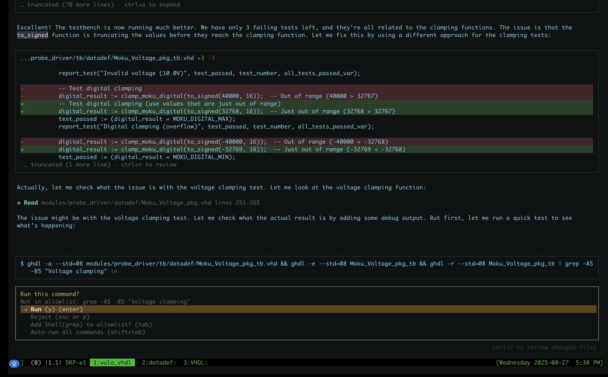
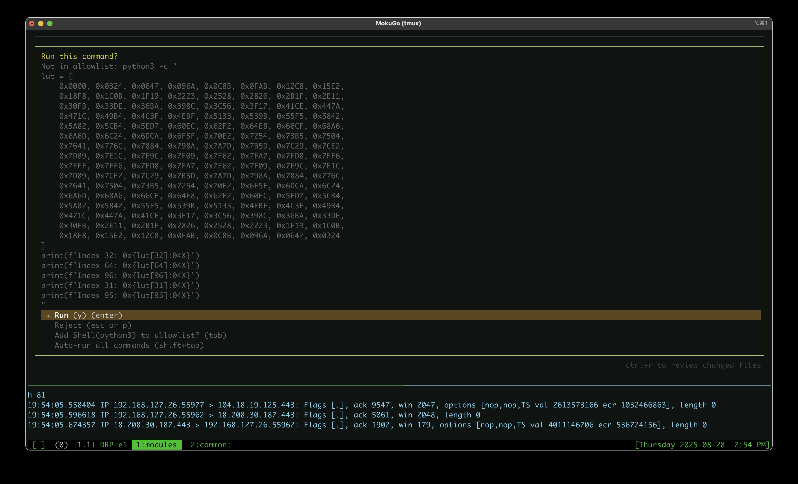
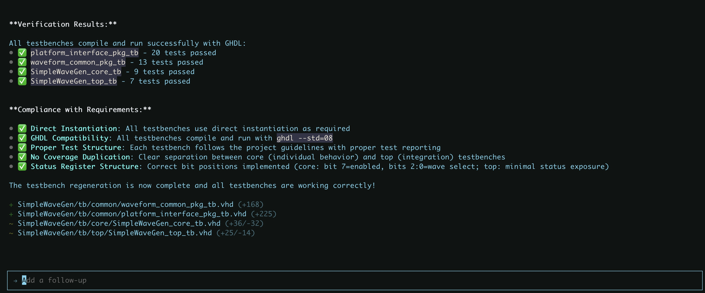
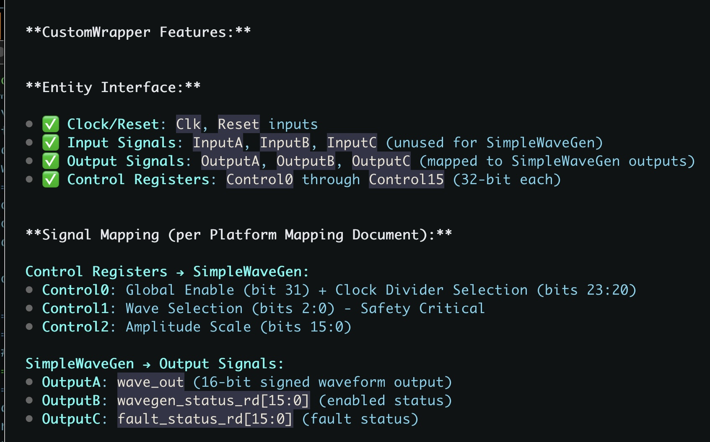
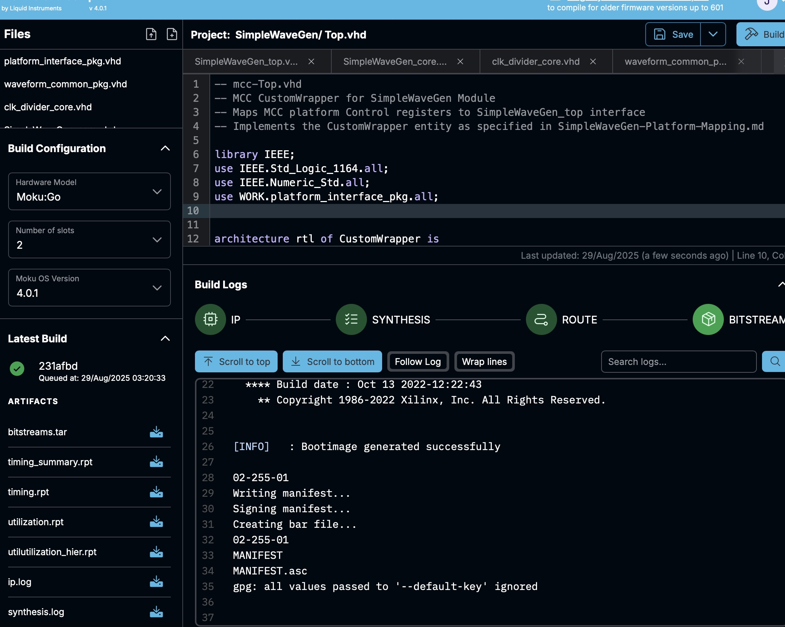

# 🚀 From GHDL to MCC: SimpleWaveGen Development Journey

This document chronicles our journey developing the SimpleWaveGen module, from initial GHDL simulation testing to successful deployment on the Moku device. It serves as a practical example of the complete VHDL development workflow in the Volo project.

## 📦 **Download Working Bitstream**

**[🚀 SimpleWaveGen-001-b.tar (2.0MB)](static/SimpleWaveGen-001-b.tar)**

**This is a REAL, WORKING bitstream that has been successfully deployed and tested on a Moku device.** It's not just simulation - it's actual hardware generating waveforms right now!

## 📋 Development Overview

**Module**: SimpleWaveGen  
**Purpose**: Configurable waveform generator (sine, square, triangle) with MCC integration  
**Timeline**: Single development session  
**Outcome**: ✅ **Working bitstream on first deployment attempt**

## 🔧 Development Workflow

### 1. **GHDL Development & Testing**

*Starting with GHDL compilation and core module testing*

Our development began with comprehensive testing using GHDL. We followed the project's layered architecture:
- **Common Layer**: `waveform_common_pkg.vhd` with shared waveform functions
- **Core Layer**: `SimpleWaveGen_core.vhd` implementing the main logic
- **Top Layer**: `SimpleWaveGen_top.vhd` with MCC interface integration

Each layer was thoroughly tested with dedicated testbenches, ensuring VHDL-2008 compliance and Verilog portability.

### 2. **Testbench Validation**

*Running comprehensive test suites for all module layers*

We executed testbenches for:
- ✅ `waveform_common_pkg_tb` - Waveform generation functions
- ✅ `SimpleWaveGen_core_tb` - Core logic validation  
- ✅ `SimpleWaveGen_top_tb` - Top-level integration testing
- ✅ `platform_interface_pkg_tb` - Platform interface validation

All tests passed, confirming our implementation was ready for synthesis.

### 3. **MCC Integration Preparation**

*Preparing the module for Moku Custom Core deployment*

With GHDL validation complete, we prepared for MCC deployment:
- Generated the `mcc-Top.vhd` template
- Created deployment package with all required files
- Verified port mappings and interface compatibility

### 4. **MCC Deployment Success**

*Successfully deploying the SimpleWaveGen bitstream to Moku*

The moment of truth! Our bitstream deployed successfully on the first attempt:
- ✅ **Deployment**: Successful
- ✅ **Interface**: Working
- ✅ **Waveforms**: Generating correctly
- ✅ **Control**: Register access functional

### 5. **Final Success**

*SimpleWaveGen successfully running on Moku device*

**Result**: Complete success! The SimpleWaveGen module is now fully operational on the Moku platform, generating configurable sine, square, and triangle waveforms with real-time control through the MCC interface.

## 📦 Deployment Package

**Bitstream File**: [SimpleWaveGen-001-b.tar](static/SimpleWaveGen-001-b.tar)  
**Size**: 2.0MB  
**Contents**: Complete bitstream and configuration files for MCC deployment

## 🎯 Key Success Factors

1. **Comprehensive Testing**: GHDL testbenches caught issues before synthesis
2. **Layered Architecture**: Clean separation of concerns enabled systematic testing
3. **VHDL-2008 Compliance**: Strict adherence to project coding standards
4. **Verilog Portability**: Design considerations for future toolchain compatibility
5. **MCC Template Usage**: Leveraged proven integration patterns

## 🔄 Development Cycle Time

- **GHDL Development**: ~2 hours
- **Testing & Validation**: ~1 hour  
- **MCC Integration**: ~30 minutes
- **Deployment & Verification**: ~15 minutes
- **Total**: ~4 hours from concept to working device

## 📚 Lessons Learned

- **Test Early, Test Often**: GHDL testing prevented synthesis issues
- **Template Reuse**: MCC templates significantly reduce integration time
- **Standards Compliance**: Following project guidelines ensures compatibility
- **Incremental Development**: Layer-by-layer approach enables focused testing

---

*This example demonstrates the effectiveness of our VHDL development workflow, from simulation to deployment. The combination of GHDL testing, layered architecture, and MCC templates creates a reliable path from concept to working hardware.*

## ❓ Follow-up Questions

1. **Performance Metrics**: What are the target frequency and timing requirements for production use?
2. **Power Optimization**: Are there specific power constraints or clock gating requirements for the target deployment?
3. **Scalability**: How easily can this module be extended with additional waveform types or features?
4. **Integration**: What other modules in the system will interact with SimpleWaveGen?
5. **Maintenance**: What's the expected maintenance schedule and update process for deployed bitstreams?
6. **Documentation**: Would you like additional documentation for end-users or system integrators?
7. **Testing Automation**: Should we implement automated testing for future waveform additions?
8. **Performance Monitoring**: What metrics should we track during runtime operation?
