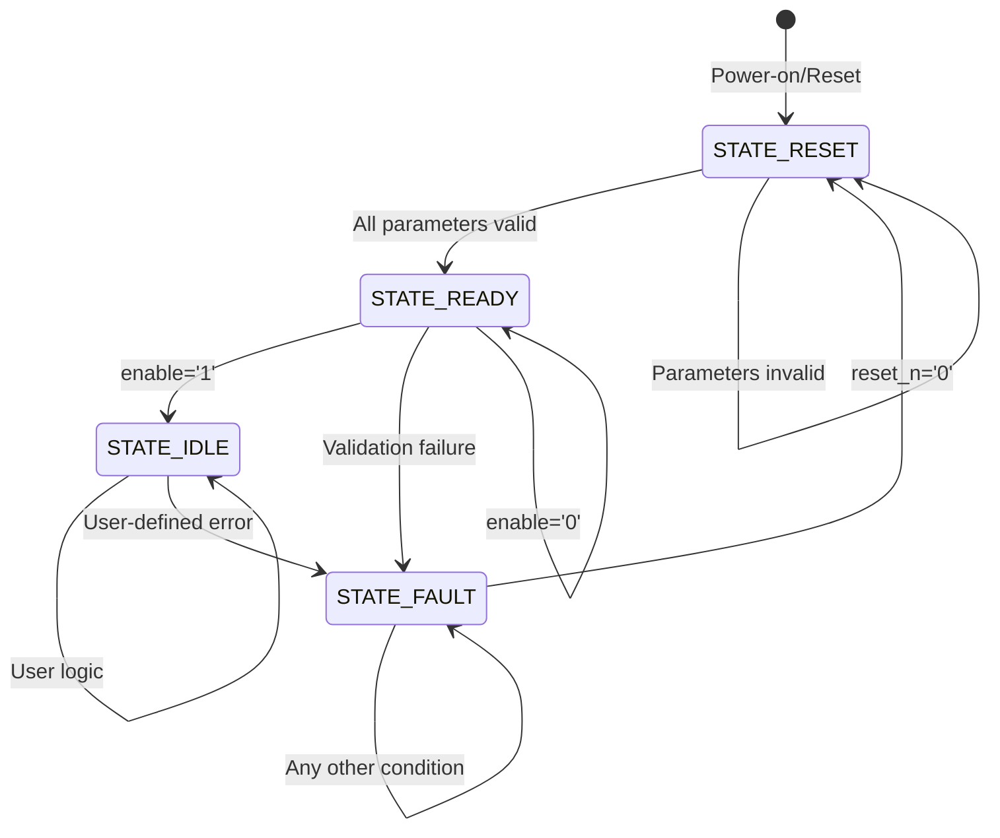

# Core State Machine Standard - VOLO VHDL

## Overview
The Core State Machine Standard defines the mandatory state machine implementation that all VOLO VHDL modules must include. This standard ensures consistent behavior, clear separation of concerns, and predictable user implementation points.

## Core Philosophy
**The core provides infrastructure, the user provides functionality.**

The core state machine handles:
- Parameter validation and initialization
- Safe state management
- Error handling and recovery
- User implementation pickup points

The user handles:
- Module-specific logic and behavior
- Output control and timing
- Custom state transitions beyond IDLE
- Application-specific functionality

## Required States

### STATE_RESET (00)
**Purpose**: Parameter validation and initialization
**Behavior**:
- All signals reset to safe state
- Input parameters validated
- Configuration loaded if valid
- Transitions to READY when all parameters valid

**User Implementation**: None required

### STATE_READY (01)
**Purpose**: Parameters validated, ready for operation
**Behavior**:
- Configuration loaded and ready
- Waiting for user trigger (enable signal)
- Transitions to IDLE when enable asserted
- Transitions to FAULT on validation failure

**User Implementation**: None required

### STATE_IDLE (10)
**Purpose**: User implementation pickup point
**Behavior**:
- Core state machine stops here
- User logic takes over
- User controls state transitions
- User controls output behavior

**User Implementation**: **This is where your module logic begins**

### STATE_FAULT (11)
**Purpose**: Validation failure state
**Behavior**:
- Persistent error state
- Only reset can exit
- All outputs in safe state
- Status register indicates fault

**User Implementation**: None required

## State Transitions



## Implementation Template

### Core Process Structure
```vhdl
core_reset_handler_proc : process(clk)
begin
    if rising_edge(clk) then
        if reset_n = '0' then
            -- Reset to safe state
            current_state <= STATE_RESET;
            -- Reset user signals
        elsif clk_en = '1' then
            -- Input validation (always check)
            -- State machine transitions
            case current_state is
                when STATE_RESET =>
                    if all_parameters_valid then
                        current_state <= STATE_READY;
                    end if;
                    
                when STATE_READY =>
                    -- Load configuration
                    if enable = '1' then
                        current_state <= STATE_IDLE;
                    end if;
                    
                when STATE_IDLE =>
                    -- USER IMPLEMENTATION PICKUP POINT
                    -- Add your logic here
                    
                when STATE_FAULT =>
                    -- Only reset can exit
                    null;
            end case;
            
            -- Check for validation failures
            if validation_failed then
                current_state <= STATE_FAULT;
            end if;
        end if;
    end if;
end process;
```

### Output Assignment
```vhdl
-- Use global constants for safe state
output_signal <= user_value when (current_state = STATE_IDLE) else GLOBAL_VOLTAGE_ZERO;
```

## User Implementation Guidelines

### What to Implement in IDLE State
1. **State Machine Logic**: Add your custom states beyond IDLE
2. **Output Control**: Determine when outputs should be active
3. **Timer Management**: Handle timing requirements
4. **Custom Transitions**: Define your state transition logic

### What NOT to Implement
1. **Parameter Validation**: Handled by core
2. **Reset Logic**: Handled by core
3. **Basic State Management**: Handled by core
4. **Error Recovery**: Handled by core (except custom errors)

### Example User Implementation
```vhdl
when STATE_IDLE =>
    -- Your custom state machine begins here
    case user_state is
        when USER_ACTIVE =>
            if user_trigger = '1' then
                -- Your custom logic
                user_state <= USER_PROCESSING;
            end if;
            
        when USER_PROCESSING =>
            if processing_complete = '1' then
                user_state <= USER_ACTIVE;
            end if;
    end case;
```

## Status Register Usage

### Standard Status Bits
- **STATUS_FAULT_BIT**: Set when in FAULT state
- **STATUS_READY_BIT**: Set when in READY state
- **STATUS_IDLE_BIT**: Set when in IDLE state
- **STATUS_ALARM_BIT**: Set on validation failures

### User Status Bits
- Use remaining bits for module-specific status
- Set in IDLE state based on user logic
- Clear automatically on state transitions

## Benefits of This Standard

### For Module Developers
1. **Consistent Behavior**: All modules follow same pattern
2. **Clear Separation**: Core vs. user responsibilities
3. **Reduced Complexity**: Core handles infrastructure
4. **Predictable Interface**: Standard state machine behavior

### For System Integration
1. **Uniform Control**: All modules respond to enable/reset consistently
2. **Standard Status**: Common status register format
3. **Predictable Recovery**: Standard error handling
4. **Easy Debugging**: Clear state visibility

### For AI Code Generation
1. **Template-Based**: Standard implementation pattern
2. **Clear Requirements**: Explicit user implementation points
3. **Consistent Output**: Predictable code structure
4. **Reduced Assumptions**: Core doesn't assume user behavior

## Migration Guide

### From Complex State Machines
1. **Identify Core Logic**: What belongs in RESET/READY/FAULT
2. **Identify User Logic**: What belongs in IDLE and beyond
3. **Simplify Core**: Remove user-specific logic from core
4. **Add User Implementation**: Move logic to IDLE state

### From Simple State Machines
1. **Add Core States**: Implement RESET/READY/FAULT
2. **Add Validation**: Parameter validation in core
3. **Add User Pickup**: Move existing logic to IDLE state
4. **Add Error Handling**: FAULT state for validation failures

## Future Extensions

The core state machine provides a solid foundation for:
- **Custom States**: Add states beyond IDLE for user logic
- **Advanced Validation**: Complex parameter validation rules
- **Custom Errors**: User-defined error conditions
- **Status Extensions**: Additional status register bits

This standard ensures that all VOLO modules have consistent, predictable behavior while providing clear points for user-specific implementation.
