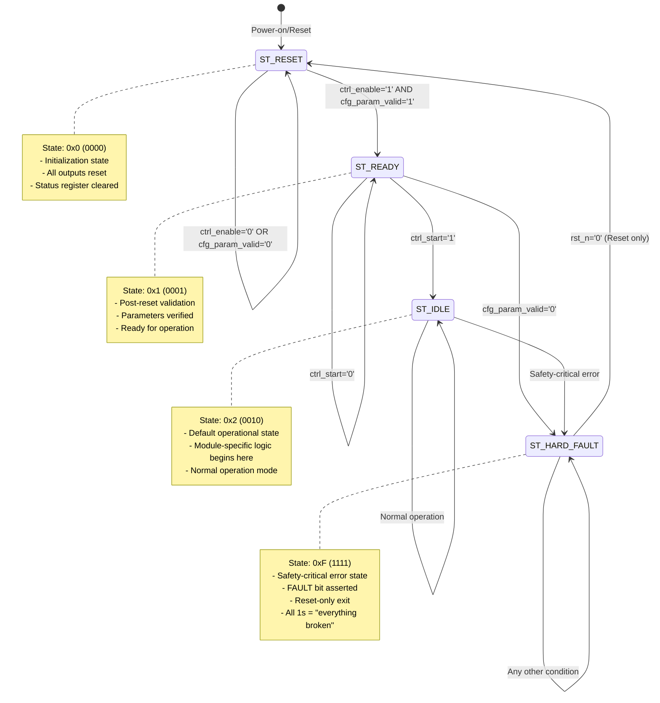
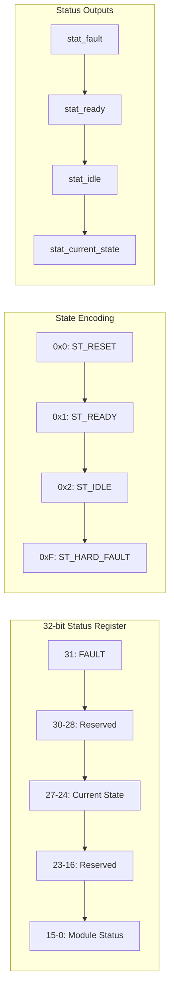

# State Machine Base - State Transition Diagram

## Overview

This document provides a visual representation of the state machine base template's state transitions and behavior.

## State Transition Diagram

## Status Register Layout

## State Transition Conditions

| From State | To State | Condition | Description |
|------------|----------|-----------|-------------|
| ST_RESET | ST_READY | `ctrl_enable='1' AND cfg_param_valid='1'` | Enable and validate parameters |
| ST_READY | ST_IDLE | `ctrl_start='1'` | Start operation |
| ST_READY | ST_HARD_FAULT | `cfg_param_valid='0'` | Parameter validation failure |
| ST_IDLE | ST_HARD_FAULT | Safety-critical error | Module-specific fault condition |
| ST_HARD_FAULT | ST_RESET | `rst_n='0'` | Reset signal (only exit mechanism) |
| Any | ST_HARD_FAULT | Invalid state detected | Error recovery |

## Status Register Updates

The status register is automatically updated on every clock cycle with:

- **Bit 31**: FAULT bit (set when in ST_HARD_FAULT)
- **Bits 30-28**: Reserved for future fault types
- **Bits 27-24**: Current state (4-bit state machine output)
- **Bits 23-16**: Reserved for module-specific status
- **Bits 15-0**: Module-specific status (input from module)

## Usage Guidelines

### For Module Developers

1. **Inherit from this template** for consistent state management
2. **Add module-specific states** using encoding 0x3-0xE
3. **Implement parameter validation** in the READY state
4. **Add safety checks** that transition to HARD_FAULT
5. **Use module_status input** to expose internal status

### For System Integration

1. **Monitor stat_fault** for safety-critical systems
2. **Use stat_current_state** for debugging and status
3. **Check stat_status_reg** for complete module status
4. **Implement reset logic** to recover from HARD_FAULT

## Safety Considerations

- **HARD_FAULT state is persistent** - only reset can exit
- **Parameter validation is mandatory** - invalid params cause HARD_FAULT
- **State visibility is automatic** - no additional debugging needed
- **Reset recovery is guaranteed** - always returns to ST_RESET

## Future Extensions

The 4-bit state encoding provides 12 additional states (0x3-0xE) for module-specific functionality:

- **0x3-0x7**: Reserved for common operational states
- **0x8-0xE**: Reserved for module-specific states
- **0xF**: HARD_FAULT (reserved for safety)

This design ensures backward compatibility while providing room for future enhancements.