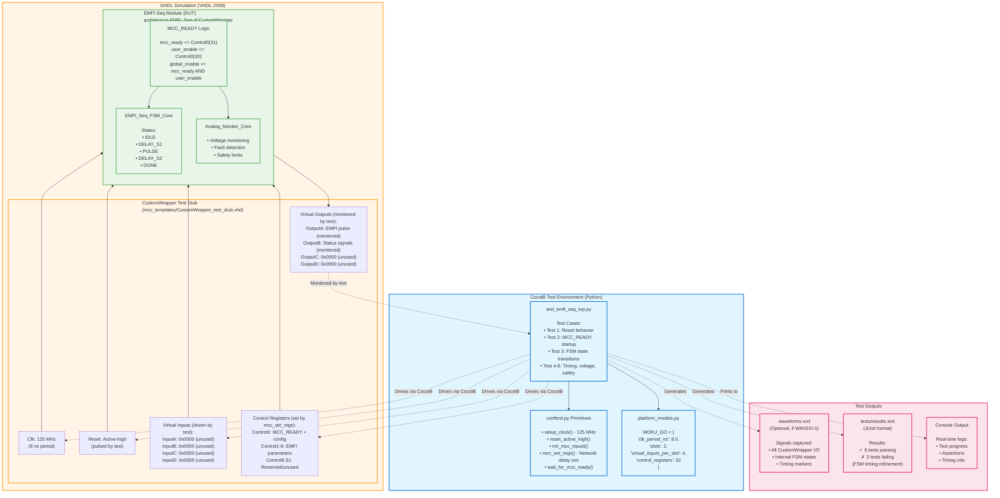

# EMFI-Seq Test Configuration (CocotB)

**Test Use Case**: CocotB testbench simulation (GHDL backend)

## Configuration Overview
- **Slot 1**: EMFI-Seq (module under test)
- **Slot 2**: Empty (unused in test environment)
- **Platform**: Simulated Moku:Go (CustomWrapper test stub)
- **All Physical I/O**: Disconnected (network control only)

## Test Architecture



## Test Workflow

### 1. **Test Initialization**
```python
@cocotb.test()
async def test_mcc_ready_startup(dut):
    """Test 2: MCC_READY Convention and Network Latency"""

    # Step 1: Hardware startup (clock + reset)
    await setup_clock(dut, clk_signal="Clk", period_ns=8.0)  # 125 MHz
    await reset_active_high(dut, rst_signal="Reset")

    # Step 2: Initialize all inputs to zero (safe state)
    await init_mcc_inputs(dut)  # InputA/B/C/D = 0

    # Step 3: Simulate MCC network delay + config load
    await mcc_set_regs(dut, {
        0: 0x40000001,  # User bits (MCC_READY auto-set by primitive)
        1: 0x0000007F,  # DelayS1
        5: 0x0000199A   # Voltage level
    }, set_mcc_ready=True)  # Simulates CR0[31]=1 after network config

    # Step 4: Wait for module to settle
    await wait_for_mcc_ready(dut)

    # Step 5: Verify behavior...
```

### 2. **Simulated Network Latency**
The `mcc_set_regs()` primitive simulates **realistic network delays**:

```python
# Default behavior: Random delay 10-200ms (realistic Wi-Fi)
await mcc_set_regs(dut, {0: 0x12345678})

# Custom delay: Explicit 50ms total
await mcc_set_regs(dut, {0: 0x12345678}, total_delay_ms=50.0)

# Reproducible timing: No randomness (deterministic tests)
await mcc_set_regs(dut, {0: 0x12345678},
                   total_delay_ms=100.0,
                   per_reg_delay_ms=10.0)
```

**Why simulate network delay?**
- Tests the **MCC_READY pattern** (Control0[31] prevents operation during all-zero state)
- Validates module behavior during **bitstream load** (realistic startup)
- Catches race conditions and initialization bugs

### 3. **All Physical I/O Disconnected**
In test environment:
- **No physical BNC connections** (InputA/B/C/D driven by test script)
- **No real ADC/DAC** (GHDL simulation only)
- **No DIO** (not needed for functional testing)
- **Network control simulated** via `mcc_set_regs()` primitive

**Focus**: Pure VHDL logic verification, not hardware integration.

### 4. **What Gets Tested**
✅ **Reset behavior**: All outputs to safe defaults
✅ **MCC_READY startup**: Module disabled until CR0[31]=1
✅ **FSM transitions**: IDLE → DELAY_S1 → PULSE → DELAY_S2 → DONE
✅ **Timing parameters**: DelayS1, DelayS2, PulseWidth from control registers
✅ **Voltage levels**: Analog monitor responds to Control5-8
✅ **Safety interlocks**: Fault detection, ALARM/FAULT flags
⚠️ **Known issues**: 2/8 tests failing (FSM timing refinement in progress)

---

## Running Tests

### Basic Test Execution
```bash
cd tests/
make TEST_MODULE=emfi_seq_top      # Run all EMFI-Seq tests
make clean                         # Clean test artifacts
make waves                         # View waveforms (if GTKWave installed)
```

### Environment Variables
```bash
WAVES=1                    # Enable waveform dump (default)
WAVES=0                    # Disable waveforms for faster tests
COCOTB_LOG_LEVEL=DEBUG     # Verbose logging
COCOTB_LOG_LEVEL=INFO      # Standard logging (default)
```

### Test Output
```
Running test_emfi_seq_top.py...
Test 1: Reset Behavior                          ✓ PASSED
Test 2: MCC_READY Startup                       ✓ PASSED
Test 3: FSM State Transitions                   ✓ PASSED
Test 4: Timing Parameters                       ✗ FAILED (timing refinement needed)
Test 5: Voltage Level Control                   ✓ PASSED
Test 6: Safety Interlocks                       ✓ PASSED
Test 7: Pulse Width Accuracy                    ✗ FAILED (FSM timing issue)
Test 8: Multi-cycle Operation                   ✓ PASSED

Results: 6 passed, 2 failed
```

---

## Comparison: Test vs Operational

| Aspect                  | Test Configuration (This Diagram) | Operational Configuration         |
|-------------------------|-----------------------------------|-----------------------------------|
| **Slot 1**              | EMFI-Seq (DUT)                   | Moku Oscilloscope (monitoring)    |
| **Slot 2**              | Empty                            | EMFI-Seq (deployed module)        |
| **Physical I/O**        | Disconnected (simulated)         | Connected to BNC cables           |
| **Clock Source**        | CocotB simulation (GHDL)         | Moku:Go FPGA (125 MHz real)       |
| **Control Input**       | Python test script               | Moku app (Wi-Fi/Ethernet)         |
| **Network Delay**       | Simulated (10-200ms)             | Real (Wi-Fi latency)              |
| **Waveform Viewing**    | GTKWave (.vcd file)              | Moku app (real-time)              |
| **Purpose**             | VHDL logic verification          | Hardware deployment & monitoring  |
| **Iteration Speed**     | Fast (local GHDL compile)        | Slower (Vivado synthesis via MCC) |

---

## Test Files

### Primary Test File
- **`tests/test_emfi_seq_top.py`**: EMFI-Seq CocotB tests (8 test cases)

### Supporting Files
- **`tests/conftest.py`**: Shared test utilities (setup_clock, mcc_set_regs, etc.)
- **`tests/platform_models.py`**: Platform specifications (MOKU_GO clock period, etc.)
- **`mcc_templates/CustomWrapper_test_stub.vhd`**: CustomWrapper entity for simulation

### Module Under Test
- **`modules/EMFI-Seq/top/Top.vhd`**: EMFI-Seq CustomWrapper architecture
- **`modules/EMFI-Seq/core/EMFI_Seq_FSM_Core.vhd`**: FSM implementation
- **`modules/EMFI-Seq/core/Analog_Monitor_Core.vhd`**: Analog monitoring logic

---

## Next Steps

### Fixing Failing Tests
1. **Test 4 (Timing Parameters)**: Refine FSM cycle counts for DelayS1/S2
2. **Test 7 (Pulse Width Accuracy)**: Verify PulseWidth register → cycle count mapping

### Expanding Test Coverage
- [ ] Multi-slot interaction tests (future: Slot 1 + Slot 2 communication)
- [ ] DIO trigger input tests
- [ ] Extended runtime tests (10k+ cycles)
- [ ] Fault injection scenario tests

### Hardware Deployment
Once all tests pass:
1. Upload bitstream via Moku Cloud Compile
2. Deploy to Moku:Go Slot 2
3. Configure MCC routing (see `EMFI_Seq_Operational_Diagram.md`)
4. Validate with oscilloscope monitoring (Slot 1)

---

**For operational deployment, see**: `docs/EMFI_Seq_Operational_Diagram.md`
**For platform details, see**: `docs/PLATFORM_MODELS.md`
**For testing guide, see**: `tests/README.md`
